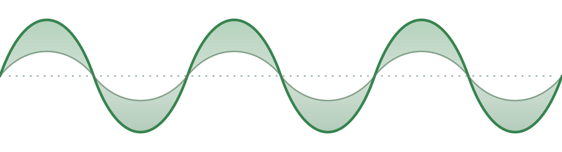
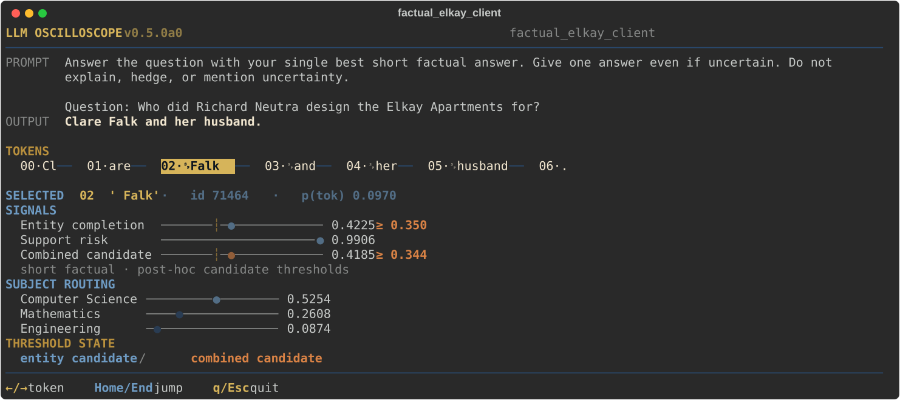

<p align="center">
  
</p>

# LLM-Oscilloscope

> For now, this repository is only a reviewer checkpoint package and an update
> of my progress. It is not ready for real use cases or deployment. For more
> information, check out [Why this repository?](#why-this-repository)

LLM-Oscilloscope turns selected model signals into separate, inspectable
measurements. The tokenwise view shows readings during generation. Experimental
active assays compare controlled inputs in separate calls; they are not
default warnings.

## Try the CLI

The easiest way to understand the project is to use the CLI with the included
Qwen2.5-7B-Instruct recordings. The recorded demos do not require a GPU.

```
python -m venv .venv
source .venv/bin/activate
python -m pip install -e .

llmosci samples
llmosci demo biology_mitochondria
```

`samples` lists all recordings. `demo` opens an interactive token explorer for
one sample. The archive contains 26 examples spanning Biology, Chemistry,
other academic subjects and natural text. Use the arrow keys to inspect what
each channel read after each token.

Live generation is available on CUDA systems running Linux or native Windows.
The default profile is designed for an 8 GB GPU with CPU offload:

```
python -m pip install -e ".[runtime]"
llmosci doctor
llmosci generate \
  "Answer with only the answer: What is the capital of Australia?" \
  --allow-download
```

The first live run downloads Qwen2.5-7B-Instruct into the normal Hugging Face
cache. Later starts are cache-only unless `--allow-download` is passed again.

The tokenwise CLI uses Qwen2.5-7B-Instruct to avoid gated Llama access. The
original detector research used Llama and remains labeled accordingly below.

There is also a separate experimental sycophancy assay. It asks whether the
same position gets more support when it belongs to the user. Try its recorded
comparison without a GPU:

```bash
llmosci sycophancy
```

It compares ten controlled A/B prompts; it is not a passive chat alarm or a
tokenwise probe. [Method, results and live use](docs/channels/SYCOPHANCY_OWNERSHIP.md)

Please read the [CLI guide](docs/CLI.md) before testing the live runtime.

## Channels

The Oscilloscope is built around several narrow measurement channels to help
understand specific processes. The current CLI exposes three channels and one
alert for unsupported entities, plus a separate active ownership assay.

### Entity completion

Entity Completion estimates whether a factual answer entity has just finished.
It reaches **0.954 AUROC / 0.824 AP** on Qwen's generations. This determines
whether the Support reading is meaningful. The next step is to extend it beyond
short factual answers to longer explanations. [Channel details](docs/entity_support_detector/ENTITY_COMPLETION.md)

### Support checking

Support Checking estimates whether a completed answer entity looks unsupported.
It reaches **0.843 AUROC / 0.921 AP** on Qwen. Together with Entity Completion,
it forms the Combined Alert. The next step is to test it on longer and more
natural generation. [Channel details](docs/entity_support_detector/SUPPORT_CHECKING.md)

### Combined alert

The Combined Alert turns Entity Completion and Support into one warning score.
It reaches **0.983 AUROC / 0.420 AP** on Llama. The CLI shows a separate
post-hoc Qwen candidate based on the same combination. The next step is to test
the complete alert on traces collected through live use. [Method and results](docs/entity_support_detector/RESULTS.md)

### Subject routing

Subject Routing estimates which academic subject area is active during
generation. It reaches **0.933 macro AUROC on Mistral** and **0.934 on Qwen**.
It can be used to see which subspace of the model is active during generation.
The next step is to extend it beyond academic prompts.
[Channel details](docs/channels/SUBJECT_ROUTING.md)

### Sycophancy ownership assay

The active assay holds two positions fixed and swaps which one belongs to
the user. On 32 new curated opinion cases, mean preference shifts were
**21.4 percentage points on SmolLM3-3B** and **53.1 on Qwen3-1.7B**, with
much smaller third-party controls. Both models saw the same cases. The score
measures this controlled assignment effect, not harmfulness or truth; factual
and wording controls show why that distinction matters. Changing the wording
changes the strength substantially. It runs separately from ordinary
generation and has no alarm threshold.
[Read the evidence and limitations](docs/channels/SYCOPHANCY_OWNERSHIP.md)

### Retrieval timing

Retrieval Timing is intended to show when a model starts pulling a factual
answer from its internal knowledge. It is not part of the CLI yet. The next
step is to turn the current causal evidence into a reliable token-by-token
measurement. [Current evidence](docs/channels/RETRIEVAL_TIMING.md)

<p align="center">
  
</p>

<p align="center"><em>A selected Qwen trace, where the model answers “Clare Falk” instead of Louis Kievman, and the false name's final token crosses the Combined candidate threshold.</em></p>

## Why this repository?

A $20,000 Emergent Ventures grant funded the discovery work for the initial
entity support detector. That work included *many* failed attempts, multiple
detector versions, label audits and mechanistic experiments. Now, I want to
build the actual instrument to use such probes, because while we discover many
interesting mechanistic findings in research, they rarely actually get used
where they are needed.

For this next round of research and building, I'm looking for grants, compute
and network, so this project will actually get used one day. Because of this,
this repository serves as a proof of my current work and ability to execute for
reviewers and other researchers.

This reviewer repository contains the part that can be inspected independently:

- a runnable CPU CLI and optional live GPU runtime
- portable measurement heads and cross-model adapters
- out-of-fold predictions and frozen evaluation outputs
- checksums, manifests and machine-readable metadata
- verification scripts and tests

## Next research steps

For concrete next experiments, updates and steps I'm currently working on, look
at the [issues tab](https://github.com/pioborgelt/llm-oscilloscope/issues).


Overall, the research will extend the existing channels to longer and more
natural generation, test how reliably they move between models and develop new
channels for distinct questions such as retrieval timing and sycophancy. Only
measurements that survive their controls should become part of the instrument.
Interventions remain a later step once a reading is reliable enough to act on.

Another point on the roadmap is reduction. Once the instrument can distinguish
where an answer process failed, different interventions can be compared under
one harness instead of being tested as isolated steering tricks.

In parallel, the Oscilloscope can gain additional channels for behavior such as
sycophancy, internal routing and retrieval override. The goal is not to add
every probe ever published. The goal is to find a small set of readings that
remain interpretable, transferable and useful for action.

However, all of this requires substantial resources that I don't currently
have, which is why I'm making this repo.

## Current state and documentation

The reports below contain most details:

| Area | Current state | Start here |
|---|---|---|
| CLI | Recorded CPU demos and a live Qwen GPU research preview | [CLI guide](docs/CLI.md) |
| Sycophancy ownership assay | Experimental active A/B comparison, GPU-free recordings and pinned SmolLM3/Qwen3 live profiles | [Method and results](docs/channels/SYCOPHANCY_OWNERSHIP.md) |
| Completion-aware detector | Packaged Llama evidence with reproducible out-of-fold and external evaluations | [Method](docs/entity_support_detector/METHOD.md) · [Evaluation](docs/entity_support_detector/EVALUATION.md) · [Results](docs/entity_support_detector/RESULTS.md) · [Entity-completion analysis](docs/entity_support_detector/ENTITY_COMPLETION_RESULTS.md) |
| Channel notes | Entity Completion, Support Checking and Subject Routing | [Entity Completion](docs/entity_support_detector/ENTITY_COMPLETION.md) · [Support Checking](docs/entity_support_detector/SUPPORT_CHECKING.md) · [Subject Routing](docs/channels/SUBJECT_ROUTING.md) |
| Cross-model transport | Qwen-native detector-channel evidence and Subject Routing adapters | [Qwen-native transfer](docs/QWEN_NATIVE_TRANSFER.md) · [Subject Routing](docs/channels/SUBJECT_ROUTING.md) |
| Active research | Retrieval Timing and a first detector-triggered intervention PoC | [Retrieval Timing](docs/channels/RETRIEVAL_TIMING.md) · [Intervention PoC](docs/INTERVENTION_POC.md) |
| Scope and artifacts | Limitations and Non-Claims, availability and redistribution boundary | [Limitations and Non-Claims](docs/LIMITATIONS.md) · [Data availability](docs/DATA_AVAILABILITY.md) · [Artifact terms](ARTIFACT_TERMS.md) · [License review](ARTIFACT_LICENSE_REVIEW.md) |

## Verify the package

The compact evidence can be checked on CPU:

```
python -m venv .venv
source .venv/bin/activate
python -m pip install -e .

python scripts/verify_results.py
python scripts/verify_ownership.py
python scripts/verify_ownership_controls.py
python -m unittest discover -s tests -q
```

The verifier recomputes the packaged evaluations, checks the portable artifacts
and validates `MANIFEST.sha256`.

The paired prompt bootstrap is slower and can be run separately:

```
python scripts/verify_bootstrap.py --iterations 2000
```

**The original detector research used Llama; tokenwise CLI generation uses Qwen. The separate ownership assay uses SmolLM3 or Qwen3.**
