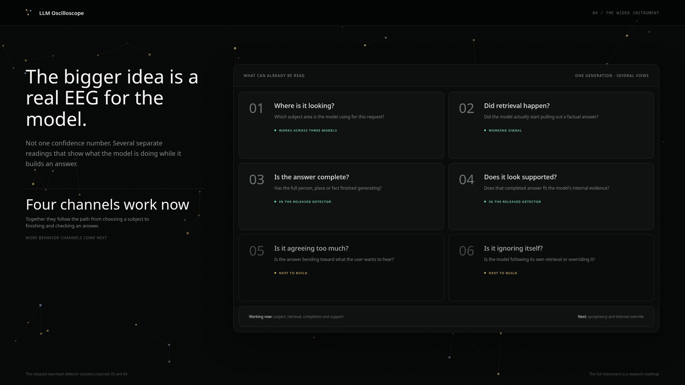
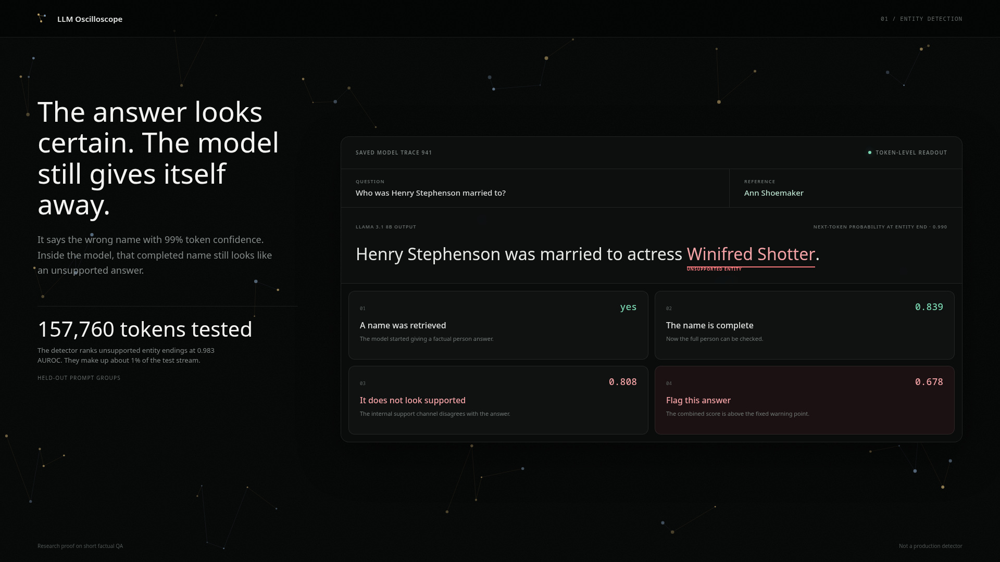
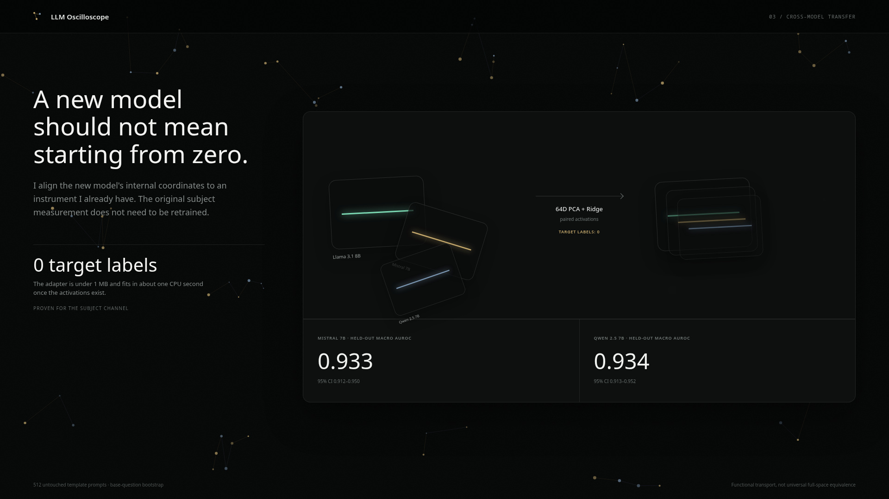
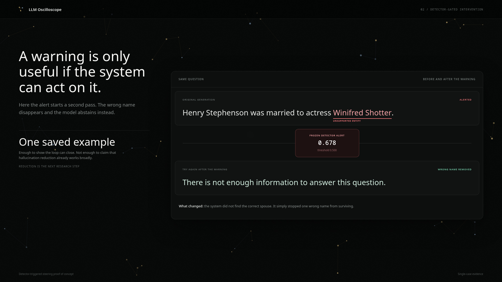

# LLM-Oscilloscope
> This repo is a checkpoint of my research progress for reviewers and potential funders. It contains a working but limited detector, and it is not ready to be deployed.


Because of the black-box problem, LLMs expose very little about what they are actually doing while they generate. Token probabilites barely tell anything about the actual confidence of the model, and they cannot show whether factual retrieval happened, which internal knowledge region was used, or whether an answer is actually supported.

Because of this, I'm building the LLM-Oscilloscope as an EEG for model generation. Its purpose is to translate some of the complex features in the model's internal representations into human-perceivable data.



A long-term goal is a model-independent instrument that can show where an answer process starts to fail and use that information to trigger a targeted intervention.


## Why this repo?

A generous $20,000 Emergent Ventures grant funded the broad discovery work that led the detector to this point. This work included *many* failed approaches, label audits, mechanistic experiments and several versions of the detector. Most of this discovery work is intentionally not included here.

What is included is the part that can already be inspected cleanly by reviewers. This includes portable measurement heads, OOF predictions, frozen evaluations, checksums and CPU verification scripts.


This is mainly here to prove that the current detector really exists and to provide a starting point for the next stage of the project.

## The current detector
The most complete part of the Oscilloscope is a per-token detector for unsupported (hallucinated) answer entities in Llama-3.1-8B-Instruct.

It uses two internal readings after every generated token. The first estimates whether a factual answer entity has just finished, and the second estimates whether that completed entity looks unsupported. Multiplying the two readings produces one alert score for every token in the natural generation stream.

Unlike many other methods, this does not require web search, repeated sampling or a second LLM at inference time. However, it does require access to the model's internal states, and it can only judge an entity *after* it has been emitted.



The example in the picture above is useful because the model is not uncertain in the normal sense. The model gives us a wrong name with a next-token probability of 0.990, and my detector is reading something different from ordinary output confidence.


The first channel waits until the full name has unfolded. This is especially important for multi-token entities, because correctness is substantially easier to read at the last entity token than at the first. Then the second channel checks the completed identity instead of trying to decide whether an incomplete fragment is correct.

Only entity completion and support checking feed the released alert. The retrieval reading shown in the trace belongs to the wider research instrument described below.


The detailed methodology and results are in the [detector method](docs/entity_support_detector/METHOD.md), [entity-completion analysis](docs/entity_support_detector/ENTITY_COMPLETION_RESULTS.md) and [main results](docs/entity_support_detector/RESULTS.md).


## Evaluation

The detector was evaluated on 157,760 naturally generated tokens. Unsupported answer-entity endings made up 1.021% of that stream.


On prompt-grouped out-of-fold evaluation it reaches 0.983 AUROC and 0.420 average precision. Leave-one-source-out evaluation reaches 0.980 AUROC and 0.391 average precision.

However, the high AUROC does not mean 98% accuracy. At an operating point near one false alarm per 100 generated tokens, precision is 0.368 and recall is 0.557. That is enough to make the detector useful as a research instrument, but not enough for deployment.

The arrays and heads for the detector are included here. `python scripts/verify_results.py` recomputes the detector, Subject Routing and Qwen transfer results. The full protocol is in [How I Evaluated The Detector](docs/entity_support_detector/EVALUATION.md).

The existing Qwen support channel now also has an option for supervised target
model onboarding. With this, the new GRANOLA result is 0.843 AUROC / 0.921 AP
on 655 answer endpoints, compared to 0.684 AUROC for the annotation neutral
adapter on the same rows. This is a stronger support readout but it uses Qwen
support labels during onboarding and is only validated on GRANOLA. See the
[support-checking channel](docs/entity_support_detector/SUPPORT_CHECKING.md) for more
information.

Also available is an additional higher recall profile, which uses the generated
L23 trajectory up to each answer endpoint. This detects 985 of 1,209 unsupported
endpoints instead of 895: an increase of 7.4 percentage points in detection
rate. This reduces the number of missed unsupported endpoints from 314 to 224,
a 29% reduction, while increasing the false alarms from 67 to 85.

## The wider instrument
The current package contains three verifiable measurement channels. The entity completion channel and the support checking channel form the alert for unsupported entities together. Separately, subject routing is released as a research channel. A single unlabeled adapter now also carries both detector channels onto Qwen's own generation stream, and the retrieval timing channel is in active polishing for release.


**[Subject routing](docs/channels/SUBJECT_ROUTING.md)** reads a graded distribution over eight academic subjects. The primary Llama test reaches 0.878 macro AUROC, and the same measurement head achieves 0.933 macro AUROC on Mistral-7B and 0.934 on Qwen2.5-7B through activation adapters. The included Qwen generation stream reaches 0.885 token-level macro AUROC.

**[Retrieval timing](docs/channels/RETRIEVAL_TIMING.md)** is evidence that a distinct retrieval-related event appears around the transition into generation. It is not a truth detector because retrieval can fire and still return the wrong fact. The current labels are not yet clean enough to release it as an equally verified channel.

**[Entity completion](docs/entity_support_detector/ENTITY_COMPLETION.md)** estimates when the model has finished producing a factual answer entity. This is the first half of the released detector.

**[Support checking](docs/entity_support_detector/SUPPORT_CHECKING.md)** estimates whether that completed answer looks unsupported. This is the second half of the released detector.

Two additional channels are on the research roadmap as concrete next steps. One would track whether the model is sycophantic towards the user's stated beliefs or preferences. The other would track whether the model follows its own retrieval signals or if it overrides them later in generation.

Each channel answers a narrower question than a general confidence score. The main research hypothesis is that reading them together will be more useful than expecting one probe to explain the entire generation.

## Transfer of the channels

Training every channel again from new labels for every model would make the Oscilloscope much less useful. A central part of the project is therefore fast channel transfer through representation alignment.



To transfer the subject routing channel, paired activations from the new model are aligned with the already existing Llama instrument using a 64-dimensional PCA and Ridge adapter. No target-model subject labels are used.

With an untouched holdout of 128 new base questions phrased using four templates, the frozen channel achieves macro AUROCs of 0.933 on Mistral-7B and 0.934 on Qwen2.5-7B. The final adapters are smaller than 1 MB and can be fitted in roughly one CPU second. In other words, they are pretty resource-friendly.
Importantly, the transfer also works for subjects it had never seen during setup. Across all 28 held-out subject pairs, it reaches 0.953 mean AUROC, compared with 0.490 for a randomized control.

However, it is important to note that this does not mean that any internal signal can be transferred between any two models. The broader domain and point in the generation process still need to match.

The same annotation-neutral onboarding method was also used on both detector channels at once, and on 2k tokens generated by Qwen itself, entity completion reaches 0.95 AUROC and support checking reaches 0.72. The support result is uneven and falls to near chance on SimpleQA, with 0.509 AUROC. Therefore this is a useful transfer but not a finished cross-model detector. The full result is in [Moving Both Detector Channels To Qwen](docs/QWEN_NATIVE_TRANSFER.md).

If labeled target-model onboarding is acceptable, the new native Qwen support
head is substantially stronger on a fresh disjoint GRANOLA test. This is an
optimization of the same support endpoint, not a label-free transfer result or
a new detector channel.


## Closing the loop
But detection is only the first step. The LLM-Oscilloscope is ultimately meant to improve what the model produces by connecting its measurements to interventions at the latent-space level.





The picture above shows a basic loop for a first intervention PoC. The detector flags the wrong name, and in the second pass the model is nudged toward saying "I don't know" instead of repeating it.

But this is just one intervention example, not a hallucination-reduction result. The system did not recover the correct spouse and broad reduction has not yet been evaluated. I still include it here because it proves that the detector output can already be connected to an action, while keeping the actual reduction claim open for the next stage of research. The frozen test and its limits are described in [A First Intervention PoC](docs/INTERVENTION_POC.md).

## Next Steps
Right now, a CLI Tool for testing the detectors with a GPU is in active development, because the current package does not offer a simple practical method for testing it.

After that, priority is natural-prevalence and long-form validation of Support
V2.

The second priority is moving from short factual QA to natural long-form generation. That requires better entity coverage, independent labels, realistic calibration and enough context to follow several factual claims in one answer.

The third priority is reduction. Once the instrument can distinguish where an answer process failed, different interventions can be compared under one harness instead of being tested as isolated steering tricks.

In parallel, the Oscilloscope can gain additional channels for behavior such as sycophancy, internal routing and retrieval override. The goal is not to add every probe ever published. The goal is to find a small set of readings that remain interpretable, transferable and useful for action.

However, all of this requires substantial resources that I don't currently have, which is why I'm making this repo.

## Non-Claims

This repository does not claim that:

- hallucinations are detected with 98% accuracy
- the detector is production-ready or covers every type of hallucination
- natural long-form generation has already been validated
- hallucination reduction has already been demonstrated broadly
- retrieval firing means that the retrieved fact is correct
- detector transfer is already uniform across datasets or ready for deployment
- retrieval timing is already an equally verified public channel

The exact evidence boundary is described in [limitations](docs/LIMITATIONS.md) and [data availability](docs/DATA_AVAILABILITY.md).

## Quick reviewer check

```
python -m venv .venv
source .venv/bin/activate
pip install -e .
python scripts/verify_results.py
python -m unittest discover -s tests -q
```

The verifier recomputes the detector evaluations, checks Subject Routing, the Qwen-native two-channel transfer and the fresh Support V2 result, and reloads the portable heads. It also reproduces both high-recall false-alarm gate failures instead of hiding them. MANIFEST.sha256 covers the complete evidence package.

The paired prompt bootstrap is slower and can be reproduced separately:

```
python scripts/verify_bootstrap.py --iterations 2000
```

The large activation caches are not included. The released predictions and weights are enough to recompute the reported metrics and confirm that the portable files load with the expected checksums and metadata. See [artifact terms](ARTIFACT_TERMS.md) and the [artifact license review](ARTIFACT_LICENSE_REVIEW.md) before redistributing model-derived files.

## Documentation

The detailed technical material lives in [docs/](docs/):

- [Method](docs/entity_support_detector/METHOD.md)
- [Evaluation](docs/entity_support_detector/EVALUATION.md)
- [Main detector results](docs/entity_support_detector/RESULTS.md)
- [Entity-completion analysis](docs/entity_support_detector/ENTITY_COMPLETION_RESULTS.md)
- [First intervention PoC](docs/INTERVENTION_POC.md)
- [Entity-completion channel](docs/entity_support_detector/ENTITY_COMPLETION.md)
- [Support-checking channel](docs/entity_support_detector/SUPPORT_CHECKING.md)
- [Subject-routing channel](docs/channels/SUBJECT_ROUTING.md)
- [Qwen-native detector transfer](docs/QWEN_NATIVE_TRANSFER.md)
- [Retrieval-timing channel](docs/channels/RETRIEVAL_TIMING.md)
- [Limitations](docs/LIMITATIONS.md)
- [Data availability](docs/DATA_AVAILABILITY.md)

**Built with Llama.**
